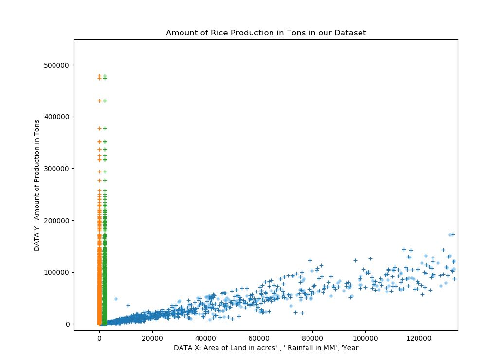

# ProjectGrenery- Machine Learning Course Project By NSU Wheatstone

## This project is a part of my first ever Machine Learning Course Project back in 2017. 

---
# Project Goal

### Our goal was to predict future production of crops in Bangladesh based on previous years data. To make smart, efficient and necessary prediction about crops production.

- To detect future weather based impact on crops production.
- To identify any possibility of drought or low production in near future

# Motivation 
- Being an agricultural country and holding a large number of population working behind it, research on this field is very important.
- Our farmers need to know the future prediction, so that they can choose the right crops to produce.
- Predicting upcoming years crops production, can be beneficial for smart crops management and export-import.
- The final organized dataset can be a good resource for observation.
- We have studies some previous research which works’ have motivated us to choose this field
<p align="center">
  
</p>

# Dataset Collection
Data sets in the site is collected by the Government. It has been made available to public by Bangladesh Bureau Statistics and Informatics Division. In this portal, there are publicly available datasets from more than 35 Ministries and related agencie

- We have extracted necessary data from some of the open source dataset provided by the Govt. of Bangladesh.
- Our data sets contain data about agriculture and atmosphere in different areas of Bangladesh.

# Crops Dataset 

<p align="center">
  
</p>

## Example of Temperature data 

<p align="center">
  
</p>

## Example of Rainfall data 

<p align="center">
  
</p>


## The datasets parameters are:
- daily and monthly rain falls,
- production of major crops in different areas,
- crop suitability,
- humidity and
- land conditions of different areas of Bangladesh.


## We are focusing on major primary Crops 
```
Aus Rice
Aman Rice
Boro Rice
Jute
Potato
Wheat
```

<p align="center">
  
</p>

## We are taking these parameters for our Model to predict the productions  
```
 Area Name/District Name
 Name of the crops
 Year of Production
 Amount of Production in Tons
 Rainfall Data
 Temperature Data
 Area of Land
```
## Different Data Sets Modes and Choices for Training/ learning Parameters 

 choice == 1

    X = Area of Land in acres','Rainfall in MM','Year'
    X = 'Area of Land in acres','Rainfall in MM', 'Temparature degree cellcius'
    X = 'Area Name','Area of Land in acres','Rainfall in MM'
    y = 'Amount of Production in Tons
    
 choice == 2:
    
    X = 'Area of Land in acres','Amount of Production in Tons','Year'
    y = dataset[['Rainfall in MM'

    y = 'Amount of Production in Tons'

## Dataset Analysis
  <p align="center">
  
</p>


## Machine learning Models we have used  

1. LinearRegression
2. RandomForestClassifier )
3. MLPClassifier
4. SVC
5. SVR
6. Ridge Regression
7. Lasso Regressioin 
8. AdaBoostClassifier
9. KNeighborsClassifier
10. LinearSVC(random_state=0)


## Results 

```

The accuracy of the best model (Linear Regression) for predicting of crops is: 0.928691493917639
```
<p align="center">
  
</p>


# References Data
[1] http://bbs.portal.gov.bd/sites/default/files/files/bbs.portal.gov.bd/page/16d38ef2_2163_4252_a28b_e65f60dab8a9/45%20years%20Major%20Crops.pdf

[2] http://data.gov.bd/dataset/daily-rainfall-data 
